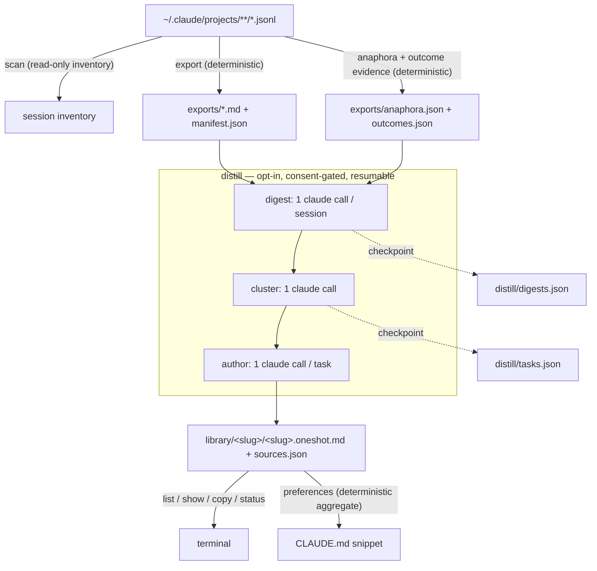

# cc-hindsight — Implementation Plan

**Tagline:** *The prompt you'd write if you knew then what you know now.*

---

## 1. Problem Statement

Claude Code users get better results the more context they front-load into their first
prompt — yet almost everyone under-specifies at t=0 and spends the session steering:
correcting course, restating preferences, answering questions the agent shouldn't have had
to ask, re-explaining constraints they've already explained in ten previous sessions.

All the evidence of what *should* have been said is sitting on disk. Claude Code persists
every session as JSONL in `~/.claude/projects/`, and a thriving tool ecosystem reads that
data — but only for usage dashboards (ccusage, sniffly), transcript rendering
(simonw/claude-code-transcripts, cctrace), or export (claude-conversation-extractor).
**Nobody closes the loop from history back to better prompting.**

cc-hindsight mines your session history into two artifacts:

1. **A local oneshot prompt library** — for each real task you've done, the realistic
   ideal first prompt: everything you knew and wanted at t=0 but didn't say, written in
   your own voice.
2. **A distilled preference set** — the durable preferences you keep re-stating across
   sessions, surfaced as candidate `CLAUDE.md` additions so they're baked in from the
   start of every future session.

The deeper goal: users get progressively better at initial prompting, and their coding
agents get progressively better aligned with them — from the first message, not the
fifteenth.

## 2. Vision & Positioning

**What it is:** a small, sharp, local-first CLI. Deterministic extraction, opt-in LLM
distillation powered by the `claude` CLI the user already has, markdown library on disk,
terminal browsing.

**What it is not:** a dashboard, a transcript renderer, a marketplace, a SaaS, a telemetry
funnel.

**Philosophical kinship (and differentiation):** closest neighbor is Simon Willison's
`claude-code-transcripts` — shared values of local-first processing, transcripts as
undervalued artifacts, small auditable tools, faithful extraction. The difference is the
direction of gaze: **he renders your sessions (backward, for others); we distill them
(forward, for you).**

**Positioning table (for README):**

| Tool | Reads `~/.claude` | Output | Direction |
|---|---|---|---|
| ccusage | ✓ | usage/cost tables | backward (metrics) |
| sniffly | ✓ | analytics dashboard | backward (behavior) |
| claude-code-transcripts | ✓ | shareable HTML transcripts | backward (record) |
| cctrace / exporters | ✓ | markdown/XML exports | backward (archive) |
| **cc-hindsight** | ✓ | **oneshot prompt library + CLAUDE.md preferences** | **forward (better next session)** |

**Trust story (a core feature, not an afterthought):** for a tool that reads your entire
conversation history, auditability is product. Two runtime dependencies. No network
calls, ever, except your own `claude` CLI doing what it already does — and never without
explicit consent per run. No telemetry. Everything written stays in your home directory.

## 3. Requirements

### Functional

- **F1** Discover all Claude Code projects and sessions under `~/.claude/projects`
  (respecting `CLAUDE_CONFIG_DIR`), with per-project session/message counts.
- **F2** Export every human session to per-session markdown containing **only
  human-authored input**, per the audited extraction rules (§5.4), plus a `manifest.json`
  for full provenance.
- **F3** Attach antecedent context to short human turns (anaphora pass, §5.5) so
  distillation never guesses what "yes", "do both", or "option 2" meant.
- **F4** Distill (opt-in): digest each session → cluster sessions into semantic tasks
  (many-to-one; low-substance sessions route to a `_misc` bucket that authors no oneshot)
  → author one realistic oneshot prompt per task, with observed preferences captured per
  task. `--no-group` gives 1 session = 1 task.
- **F5** The LLM stage runs exclusively through the user's local `claude` CLI
  (`claude -p`), never without explicit consent: separate subcommand, upfront
  invocation-count disclosure, `[y/N]` prompt, `--yes` bypass for automation, `--dry-run`
  that prints the exact plan and exits.
- **F6** Authored oneshots must pass the **"knowable at t=0" test** (§5.6): front-load
  intent, constraints, preferences, quality bars; never front-load session-discovered
  facts — and must respect a **realistic effort budget**: the length and structure a
  motivated human would actually type.
- **F7** Browse the library in the terminal: `list`, `show <slug>`, `copy <slug>`
  (clipboard), `status` (pipeline funnel view, including orphaned/skipped entries).
- **F8** `preferences` aggregates per-task preferences across the library into a
  frequency-ranked, paste-ready `CLAUDE.md` snippet (deterministic; optional single-call
  LLM consolidation behind the same consent gate).
- **F9** Every distill stage is resumable and Ctrl-C safe (checkpoints to disk; re-running
  skips completed work). Checkpoints carry a generation id; `distill --fresh` resets
  deliberately; `status` flags library entries orphaned by re-clustering.
- **F10** Each command ends by suggesting the next step (scan → export → distill →
  list/copy), forming a self-guiding funnel.
- **F11 Outcome awareness:** a deterministic pass extracts bounded *outcome evidence* per
  session (final human turns + final assistant tail, clearly labeled); the digest stage
  classifies each session's outcome (`completed | partial | abandoned | unclear`); the
  author stage states confidence, and tasks with no completed/partial member sessions are
  skipped (reported in `status`) rather than distilled into confident prompts that
  reproduce failure paths.

### Non-functional

- **N1** TypeScript, ESM-only, Node ≥ 22 (active LTS; stable `util.parseArgs` and
  `util.styleText`).
- **N2** Runtime dependencies: exactly two — `citty` (CLI, itself zero-dep) and `zod` v4
  (schema single-source-of-truth). Colors via `node:util` `styleText`; tables hand-rolled
  (~15 lines); clipboard via ~10-line helper (`pbcopy` / `wl-copy` / `xclip` / `clip`).
- **N3** Dev toolchain: tsdown (build + d.ts), vitest (tests), Biome 2.x (lint + format,
  single tool), GitHub Actions CI (ubuntu + macos, Node 22).
- **N4** Distribution: npm package `cc-hindsight` (verified unclaimed), headline install
  `npx cc-hindsight`. All work stays local for now — no publishing, no git remote.
- **N5** Tests never touch the real `~/.claude`; all fixtures are synthetic. Every
  extraction audit rule has a dedicated regression fixture.
- **N6** License MIT. Conventional commits, one commit per task minimum.
- **N7** Small enough to audit in one sitting: target < ~2,500 LOC of `src/` excluding
  tests.

## 4. Background & Research

### 4.1 What the trial implementation proved

The prior trial (`sopc`, Python + an agent-runtime workflow) validated the pipeline
end-to-end. Carried forward:

- **Audited extraction rules** — an eight-session audit produced precise rules for what
  counts as human input in Claude Code JSONL (§5.4). Hard-won knowledge; ports as code +
  one test fixture per rule.
- **Recall-oriented anaphora** — don't classify which short turns are referential
  (unreliable); attach antecedent context to *every* short turn and let the authoring
  stage judge relevance. False positives are free; false negatives are the failure mode.
- **Cross-file dedupe** — Claude Code copies history into a new file on fork/resume; the
  same message appears in multiple transcripts. Attribute each (timestamp, text) to the
  earliest session so evidence is never double-counted. (Timestamp keying correctly
  distinguishes fork-copies from deliberate re-sends, which get new timestamps.)
- **`AskUserQuestion` recovery** — the user's option selections are human-authored
  decisions; export them as `[decision] "Q" → answer` lines, first-class requirements
  downstream.
- **Digest → cluster → author** as three stages with structured outputs works;
  many-sessions-to-one-task grouping produces the right library granularity.

### 4.2 What the critical pass found (flaws to fix)

A full adversarial re-read of the trial surfaced ten flaws; each has a disposition baked
into this plan:

| # | Flaw | Disposition |
|---|---|---|
| 1 | **Outcome blindness** — no signal whether a session succeeded; failed sessions could be distilled into confident "ideal" prompts | F11: outcome evidence pass + digest classification + author confidence + skip fully-failed tasks |
| 2 | **Hindsight leakage** — authored prompts contain facts only discovered mid-session (e.g. exact config paths, root causes) | The "knowable at t=0" test, §5.6 |
| 3 | **Unrealistic length** — ~700-word spec-like oneshots with nested headings that no human would type | Effort budget + structure cap in the author contract, §5.6 |
| 4 | **Forced clustering** — "every session must land in a task" crams trivia into real tasks, diluting oneshots | `_misc` routing + substance threshold (default: <2 human messages), §5.6 |
| 5 | **Human slash-commands and images silently vanish** — dropped by the `<` heuristic / ignored | New rules R10 (`[command]` lines) and R11 (`[image pasted]` markers), §5.4 |
| 6 | **Over-broad `<` drop** — a genuine human message starting with pasted XML dies entirely | Keep the conservative drop (fidelity of exports wins) but log every dropped piece under `--verbose`; extraction-fidelity issue template invites reports |
| 7 | **O(N²) recomputation** — the trial re-exported every session per anaphora alignment | Export/anaphora/outcome share one dedupe pass, §5.5 |
| 8 | **Branch-blind antecedents** — linear timestamp scan can pick the wrong assistant turn on forked/regenerated conversations | Documented v1 limitation; parentUuid walking is a v1.1 improvement |
| 9 | **No generator provenance / stale outputs** — no record of model or prompt version; re-clustering leaves orphaned task dirs counted as done | `sources.json` gains model/prompt_version/tool_version/generation; `status` flags orphans; `distill --fresh` |
| 10 | **Secrets written silently** — pasted API keys land in plaintext exports without a word | README states it plainly (your data, your disk, your Claude account); `--redact` on the roadmap |

### 4.3 Ecosystem & distribution recon

- The two distribution archetypes: **ccusage** (TypeScript/npm, `npx ccusage`) and
  **sniffly** (Python/PyPI, `uvx sniffly init`). Every Claude Code user already has Node —
  npx is the zero-friction path. → TypeScript/npm.
- README patterns that correlate with spread: hero one-liner install, animated demo,
  privacy-first section, comparison table, FAQ. simonw's README style (plain, demo-first,
  live examples) is the model.
- **Marketplace decision:** Claude Code has an official plugin/marketplace format and
  community catalogs list thousands of skills. We will **not** build a marketplace
  (crowded, undifferentiated, conflicts with the personal/private identity). Roadmap:
  package cc-hindsight *as a plugin* into existing marketplaces (distribution channel,
  not product).

### 4.4 Stack recon (mid-2026 state of the art)

| Layer | Pick | Why |
|---|---|---|
| Build | **tsdown** | tsup's docs recommend it for new projects; Rolldown/Oxc, bundles + emits d.ts, zero config |
| CLI | **citty** | zero-dependency (wraps native `parseArgs`), TypeScript-first, elegant subcommands, unjs ecosystem |
| Colors | **`node:util` `styleText`** | built-in; Node publishes an official chalk→styleText codemod; one less dep to audit |
| Validation | **zod v4** | ecosystem standard; `z.toJSONSchema()` gives JSON Schema derivation for free |
| Lint/format | **Biome 2.x** | single Rust binary replaces ESLint+Prettier; production-ready since 2.0 |
| Tests | **vitest** | the standard; what contributors expect |
| Node | **≥ 22** | Node 20 EOL'd April 2026 |

### 4.5 Claude Code native orchestration (verified)

- `claude -p --output-format json` is the supported headless mode; a **`--json-schema`**
  flag makes the CLI itself validate/coerce the response against a supplied JSON Schema.
- The **Claude Agent SDK** exposes the full agent loop (subagents, dynamic fan-out) as a
  TS library — the native equivalent of the trial's workflow runtime.
- **Decision:** orchestrate plain `claude -p` calls ourselves, with `--json-schema`
  derived from zod. Rationale: (a) consent/cost transparency — `--dry-run` can state the
  exact invocation count, which SDK self-orchestration cannot; (b) stage checkpoints give
  resumability and trivial test mocking; (c) zero added dependencies vs. shipping an
  agent runtime. SDK and an in-session skill variant are roadmap items.

## 5. Design

### 5.1 Architecture



Deterministic stages (scan/export/anaphora/outcome, browsing, preference aggregation)
never invoke an LLM. The dashed boundary around distill is the only place `claude` runs,
and it never runs implicitly.

### 5.2 CLI surface

```
npx cc-hindsight                  # = scan (safe default) + "next step" hint
cc-hindsight scan                 # inventory: projects, sessions, human-message counts
cc-hindsight export [--project X] [--min-messages N] [--verbose]
cc-hindsight distill [--project X] [--no-group] [--min-substance N] [--model M]
                     [--fresh] [--dry-run] [--yes]
cc-hindsight list                 # library table: slug, title, #sessions, dates
cc-hindsight show <slug>          # render oneshot to terminal
cc-hindsight copy <slug>          # oneshot → clipboard
cc-hindsight status               # funnel: discovered → exported → digested → clustered
                                  # → authored; flags orphans and skipped tasks
cc-hindsight preferences [--consolidate] [--yes]
```

Global flags: `--home <dir>` (default `~/.cc-hindsight`, env `CC_HINDSIGHT_HOME`),
`--claude-dir <dir>` (default `~/.claude`, env `CLAUDE_CONFIG_DIR`). Exit codes: 0
success, 1 error, 2 consent declined.

### 5.3 Data layout & file formats

```
~/.cc-hindsight/
  exports/
    <project>-<uuid8>.md          # human-only session export
    manifest.json                 # [{export, source, project, sessionId, messages, first_ts, last_ts}]
    anaphora.json                 # {export: [{index, timestamp, human_text, antecedent, decision_kind, decision_text}]}
    outcomes.json                 # {export: {final_human_turns[], final_assistant_tail}}   (bounded, labeled)
  distill/
    digests.json                  # {generation, digests: {export: {goal, deliverable, domain, keywords[], outcome}}}
    tasks.json                    # {generation, tasks: [{slug, title, rationale, members[]}], misc: [members...]}
  library/
    <slug>/
      <slug>.oneshot.md           # provenance HTML comment + title + the prompt
      sources.json                # {slug, title, members[], sessionIds[], preferences: [{text, evidence}],
                                  #  outcome_summary, confidence, authored_at, model, prompt_version,
                                  #  tool_version, generation}
```

Export file format (per session): header comment with source path and message count, then
`### <timestamp>` + message text blocks, chronological. Project short-name derived from
the last path segment of the decoded project directory name (no user-specific
hardcoding).

### 5.4 Extraction rules (the fidelity contract)

Ported from the audited Python extractor; every rule gets a code comment citing the
transcript shape it handles and a dedicated test fixture:

- **R1 Admission:** human input lives on `type: "user"` AND `type: "attachment"` entries
  (attachments hold messages typed while the agent was busy).
- **R2 Rejection (checked before reading content):** drop entries with `isMeta`,
  `isSidechain` (subagent threads), `isCompactSummary` / `isVisibleInTranscriptOnly`
  (model-authored /compact summaries), or `entrypoint` starting with `"sdk"` (automation;
  note: do *not* key on `promptSource === "sdk"` — VS Code sets that on genuine human
  typing).
- **R3 Attachments:** only `queued_command` with `origin.kind === "human"` and
  `commandMode === "prompt"` → the prompt text.
- **R4 String content:** clean per-piece (R6).
- **R5 Array content:** collect `text` blocks; from `tool_result` blocks, recover the
  human's typed follow-up after the `"the user said:"` tool-rejection marker (preceding
  text is boilerplate).
- **R6 Per-piece cleaning:** strip; drop empty pieces, pieces starting with `<`
  (machine-injected blocks like `<ide_opened_file>`), and interruption markers — applied
  per piece so machine blocks never take human prose down with them. Every dropped piece
  is logged under `--verbose` so false drops are visible and reportable.
- **R7 Decisions:** recover `AskUserQuestion` selections as `[decision] "Q" → answer`
  lines — verbatim human choices, first-class requirements downstream.
- **R8 Cross-file dedupe:** global; attribute each (timestamp, text) to the earliest
  session; drop copies created by fork/resume.
- **R9 No hardcoded skips:** sessions with zero human messages are skipped naturally;
  `--min-messages` and `--project` filters replace machine-specific skip lists.
- **R10 Command recovery:** human-issued slash-command invocations (including custom
  project commands with args) are recovered as `[command] /name args` lines — they are
  human intent.
- **R11 Non-text input markers:** image/attachment content blocks emit an
  `[image pasted]` placeholder — supplying visual context is part of how the human
  actually prompted, and belongs in a realistic oneshot ("…and here's the screenshot").

### 5.5 Anaphora + outcome evidence pass (deterministic)

**Anaphora:** for every human turn of ≤ 15 words, attach: (a) the tail of the immediately
preceding assistant turn (~1,600 chars — the ask lives at the end of an essay), and
(b) any pending `ExitPlanMode` plan or `AskUserQuestion` question surface
(`decision_kind`, `decision_text`) — i.e., what a bare "yes" actually approved.
Recall-oriented by design. Attached assistant text is consumed *only* to resolve meaning;
it is never copied into a oneshot. Indices must align exactly with the exported markdown
— export, anaphora, and outcome passes share a single dedupe pathway (fixes the trial's
O(N²) recomputation).

**Known v1 limitation:** antecedent selection is a linear timestamp scan; on
forked/regenerated conversations it can pick the wrong branch. parentUuid walking is a
planned v1.1 improvement; a known-edge-case fixture is marked TODO.

**Outcome evidence:** per session, capture the final N human turns and the final
assistant tail (bounded, clearly labeled as machine-authored context) into
`outcomes.json`. This is *distill input only* — the export artifact stays human-only.
Rationale: without an outcome signal, failed or abandoned sessions would be distilled
into confident "ideal" prompts that reproduce failure paths.

### 5.6 Distill stages & prompt design

All stages: spawn `claude -p --output-format json --json-schema <schema.json>` with the
stage prompt on stdin, content inlined (no file access needed — run with tool use
disabled; exact flag verified at implementation, with an instruction-level fallback).
Schemas defined once in zod; JSON Schema derived via `z.toJSONSchema()`; responses
re-validated with the same zod schema. One retry on validation failure. Default timeout
300s/invocation. `--model` passes through. Prompt builders carry a `prompt_version`
constant, bumped on meaningful changes.

**Stage 1 — digest** (1 call per session, resumable): input is the export content (capped
~50k chars, head+tail split for monsters) plus the session's labeled outcome evidence;
output `{goal, deliverable, domain, keywords[], outcome}` where
`outcome ∈ {completed, partial, abandoned, unclear}`.

**Stage 2 — cluster** (1 call): input is all digests; rules: group sessions pursuing the
same underlying goal (many-to-one; never force 1:1), dual-membership allowed with
rationale, unique 2–5-word kebab slugs, and **low-substance or trivia sessions route to a
`_misc` bucket that authors no oneshot**. Sessions below the substance threshold
(default: <2 human messages, `--min-substance`) never reach the clusterer. Validation:
slug uniqueness, every non-misc session lands somewhere, fail loudly otherwise.

**Stage 3 — author** (1 call per task; tasks whose member sessions are all
abandoned/unclear are skipped and reported): the heart of the tool. Inputs: task
title/rationale, member export contents, relevant anaphora records, outcome
classifications. Output JSON:
`{slug, title, oneshot_markdown, confidence, preferences: [{text, evidence}]}` — *our
code* writes the files.

The authoring prompt's core contract:

**The "knowable at t=0" test** — for every candidate line: *could the human plausibly
have known or wanted this before the session started?*

- **Front-load (knowable):** the goal and concrete deliverable; output format and quality
  bar; tech stack and environment facts the user obviously knew; standing preferences and
  working style (e.g. "diagnose before acting, don't guess", "be honest about what's
  certain vs. inferred", "make it idempotent", "back up before modifying"); constraints
  and things to avoid; resolved decisions from anaphora records (folded in as explicit
  instructions).
- **Never front-load (discovered):** file paths first seen mid-session; root causes;
  specific config values/mechanisms; error messages; tools or facts the user visibly
  learned along the way.
- **Transform, don't leak:** where the session's value was an investigation the human
  steered, express the *direction* as direction — "figure out why my tmux sessions
  vanish; verify the mechanism against the actual config; state plainly what's certain
  vs. inferred" — not the answer.

**The effort budget** — an ideal-but-untypeable prompt fails the teaching mission just
like an omniscient one:

- Target the length a motivated human would actually type: typically 100–300 words; go
  longer only when the task genuinely warrants it, prioritizing the highest-leverage
  specifications.
- Prose-first, minimal structure: a paste-able prompt, not a spec with nested headings
  and checklists.

**Voice & provenance:**

- First person, the user's own register as *inferred from the exports* (terse if they're
  terse) — never an asserted persona.
- Never copy assistant prose; `[decision]` lines are verbatim human choices — honor them.
- State confidence; flag tasks built on partial outcomes.

**Preferences:** alongside the prompt, extract durable, recurring, cross-task-worthy
preferences with one-line evidence each.

### 5.7 Consent & cost UX (exact copy)

```
$ cc-hindsight distill
  distill will invoke your local `claude` CLI (your subscription/credits):
    • 14 session digests
    •  1 clustering call
    • ~5 oneshot authoring calls (one per task; exact count known after clustering)
  ≈ 20 invocations total. Nothing is sent anywhere except through your own claude CLI.
  Proceed? [y/N]
```

`--dry-run` prints the same plan plus the per-stage target sessions and exits 0 without
invoking anything. `--yes` skips the prompt (for scripting). Declining exits 2. Resume
behavior is stated when checkpoints exist ("9 of 14 digests already done; will run
5 + 1 + ~5"). `--fresh` clears distill checkpoints after an explicit confirmation.

### 5.8 Preferences aggregation

Deterministic: collect `preferences[]` from every `sources.json`, normalize
(trim/case-fold), dedupe near-identical strings, rank by frequency × recency, emit a
paste-ready `CLAUDE.md` block with evidence counts ("stated in 7 of 12 tasks"). Optional
`--consolidate`: one `claude -p` call to merge semantic duplicates and tighten wording —
behind the same consent gate.

### 5.9 Error handling & resilience

- `claude` not on PATH → clear message with install pointer; deterministic commands still
  work fully.
- `--json-schema` unsupported (old CLI) → detect via version probe; fall back to
  schema-in-prompt + zod validation with one retry.
- Malformed/failed stage output → retry once; on second failure, checkpoint progress,
  report which sessions/tasks failed, exit 1 (re-run resumes).
- Unreadable/corrupt JSONL lines → skip line, count, report in `--verbose` (never abort a
  whole export for one bad line).
- Transcript format drift (Claude Code updates) → tolerant parsing (unknown fields
  ignored; admission/rejection rules are allow-list based), fixtures pin known shapes,
  README notes the tested Claude Code version range.

### 5.10 Testing strategy

- Unit: extractor (one fixture per audit rule R1–R11), anaphora (short-turn detection,
  antecedent capture, plan/question surfacing, index alignment), outcome evidence
  bounds, rendering, preference aggregation, table/clipboard helpers (clipboard behind an
  interface, mocked).
- Integration: fake `--claude-dir` fixture tree (multi-project, forked session,
  automation session, monster session) driving scan/export end-to-end; distill
  orchestration against a mocked spawn layer (success, malformed-then-valid retry,
  missing binary, declined consent, resume-from-checkpoint, `--fresh`, orphan
  detection).
- Prompt-contract tests: authoring prompt text asserts the presence of the t=0 test, the
  never-front-load list, the effort budget, and the never-copy-AI-prose rule (guards
  against accidental prompt regression).
- Quality of authored output is verified by human review in the Task 9 demo against the
  trial's known-flawed tmux oneshot (automated tests can't judge prompt quality
  honestly).

### 5.11 Repository layout

```
cc-hindsight/
  src/
    cli.ts                # citty entry: command registry, global flags, funnel hints
    commands/             # scan.ts export.ts distill.ts list.ts show.ts copy.ts status.ts preferences.ts
    core/
      discover.ts         # projects/sessions inventory (path decoding, short names)
      extract.ts          # R1–R7, R10, R11 (the audited extractor)
      dedupe.ts           # R8 cross-file dedupe (single shared pass)
      anaphora.ts         # §5.5 anaphora
      outcome.ts          # §5.5 outcome evidence
      render.ts           # export markdown + oneshot file writing
      preferences.ts      # §5.8 aggregation
    claude/
      runner.ts           # spawn claude -p, --json-schema, retry, timeout, version probe
      consent.ts          # §5.7 gate + dry-run
      schemas.ts          # zod schemas (digest/cluster/author) + toJSONSchema derivation
      prompts/            # digest.ts cluster.ts author.ts (string builders + prompt_version)
    distill/
      pipeline.ts         # stage orchestration + checkpoints + generations + resume
    ui/
      style.ts            # styleText wrappers, table(), progress lines
      clipboard.ts        # pbcopy/wl-copy/xclip/clip helper
  test/
    fixtures/             # synthetic JSONL trees, expected exports, mock claude responses
    *.test.ts
  PLAN.md  README.md  LICENSE  CONTRIBUTING.md
  .github/workflows/ci.yml  .github/ISSUE_TEMPLATE/
  package.json  tsconfig.json  tsdown.config.ts  biome.json  vitest.config.ts
```

## 6. Task Breakdown

Convert the design into working software incrementally; every task ends runnable and
demoable, each builds on the last, nothing is orphaned.

**Task 1: Scaffold the repository**
- Objective: a building, testing, committable TypeScript CLI skeleton.
- Guidance: package.json (name `cc-hindsight`, `bin`, ESM, `engines.node >= 22`, MIT);
  tsconfig (strict); tsdown config; vitest config; biome.json; citty root command with
  `--version`/`--help` and stub subcommands; `src/ui/style.ts` with `styleText` wrappers +
  `table()`; CI workflow (ubuntu+macos × Node 22: biome check → tsc --noEmit → vitest run
  → tsdown build → `npm pack --dry-run`); LICENSE, .gitignore.
- Tests: smoke test — CLI reports version; table helper renders aligned columns.
- Demo: `npm run build && node dist/cli.js --help` shows the full command surface; CI
  config valid; clean commit history.

**Task 2: Session discovery + `scan`**
- Objective: accurate inventory of everything on the machine.
- Guidance: `core/discover.ts` — resolve claude dir (flag > env > default), enumerate
  project dirs, decode dash-encoded paths to short names, list top-level `*.jsonl`
  (nested subagent dirs excluded), cheap entry counts; `scan` command with table
  (project, sessions, latest activity) and funnel hint.
- Tests: fixture claude-dir tree (multi-project, nested subagent dir, empty project);
  assert discovery, short names, counts; real home directory never touched.
- Demo: `cc-hindsight scan` lists actual projects on the real machine.

**Task 3: The audited extractor**
- Objective: `extractText()` faithful to every audit rule — the fidelity contract.
- Guidance: implement R1–R7 + R10 + R11 in `core/extract.ts`, each rule commented with
  the transcript shape it handles; interruption-marker set, per-piece cleaning with
  verbose drop logging, tool-rejection recovery, `[decision]` rendering, `[command]`
  recovery, `[image pasted]` markers, queued_command attachments.
- Tests: one synthetic JSONL fixture per rule (meta, sidechain, compact summary, sdk
  entrypoint, VS Code promptSource false-positive guard, `<ide_opened_file>` piece
  survival, tool-rejection recovery, attachment admission, decision recovery, command
  recovery, image marker) — the regression wall.
- Demo: test run shows every audit rule green; extraction of a mixed fixture yields
  exactly the human messages, nothing else.

**Task 4: `export` command**
- Objective: per-session human-only markdown + manifest, deduped.
- Guidance: `core/dedupe.ts` (R8 global cross-file dedupe, earliest-session attribution,
  single shared pass), `core/render.ts` (export format §5.3), `--min-messages`/`--project`
  filters (R9), write to `<home>/exports/`, funnel hint.
- Tests: fixture with a forked session (duplicated history) → copies dropped, attribution
  correct; manifest integrity; idempotent re-run.
- Demo: run against real `~/.claude`; inspect an export and the manifest; re-run is a
  no-op.

**Task 5: Anaphora + outcome evidence (folded into `export`)**
- Objective: `anaphora.json` and `outcomes.json` giving the distill stages resolved
  referents and outcome signal.
- Guidance: §5.5 — ≤15-word attachment, assistant-tail extraction, pending
  ExitPlanMode/AskUserQuestion surfacing, bounded final-turns outcome capture; share the
  dedupe pathway so indices align with written exports; document the branching
  limitation; `--verbose` prints attached turns per session.
- Tests: fixture where "yes" follows a plan proposal and "option 2" follows a question →
  antecedent + decision_kind/text captured; index alignment asserted against rendered
  export; outcome evidence bounds respected.
- Demo: `cc-hindsight export --verbose` reports e.g. "12 short turns attached (5 had a
  pending plan/question); outcome evidence captured for 14 sessions".

**Task 6: Claude runner + consent gate**
- Objective: the safe, testable bridge to `claude -p`.
- Guidance: `claude/runner.ts` (PATH check with install pointer, version probe, spawn
  with `-p --output-format json --json-schema`, stdin prompt, timeout, one retry,
  schema-in-prompt fallback, tool use disabled); `claude/schemas.ts` (zod v4 +
  `z.toJSONSchema()`); `claude/consent.ts` (§5.7 exact copy, `--yes`, `--dry-run`,
  exit 2 on decline).
- Tests: mocked spawn — success, malformed-then-valid retry, hard failure, missing
  binary, version fallback; consent — accept/decline/`--yes`/dry-run never spawns.
- Demo: `cc-hindsight distill --dry-run` on real data prints the full invocation plan and
  cost disclosure without spending anything.

**Task 7: Distill stage 1 — digest**
- Objective: one structured digest per session (goal, deliverable, domain, keywords,
  outcome), resumable.
- Guidance: `claude/prompts/digest.ts` (content inlining with 50k head+tail cap + labeled
  outcome evidence), `distill/pipeline.ts` stage loop with `digests.json` checkpoint +
  generation id (skip done, save after each), progress lines.
- Tests: mocked runner — checkpoint written incrementally, resume skips completed, one
  session's failure doesn't abort the rest, outcome field validated.
- Demo: real run on the smallest project; inspect `digests.json` for sensible
  goals/outcomes; Ctrl-C mid-run then re-run resumes.

**Task 8: Distill stage 2 — cluster**
- Objective: sessions grouped into semantic tasks, junk kept out.
- Guidance: `claude/prompts/cluster.ts` (rules §5.6 incl. `_misc` routing), substance
  threshold pre-filter (`--min-substance`, default 2), single call, `tasks.json`
  checkpoint + generation id; `--no-group` synthesizes 1:1 tasks deterministically (no
  LLM call); validate slug uniqueness + coverage, fail loudly.
- Tests: mocked responses — valid clustering accepted; duplicate slugs / dropped sessions
  rejected; `_misc` routing honored; substance pre-filter; `--no-group` path.
- Demo: `tasks.json` on real data shows believable many-to-one groupings with rationales
  and trivia routed to `_misc`.

**Task 9: Distill stage 3 — author (the heart)**
- Objective: realistic oneshots + preferences in the library.
- Guidance: `claude/prompts/author.ts` implementing the full §5.6 contract (t=0 test,
  transform-don't-leak, effort budget, structure cap, inferred voice, anaphora
  consumption, outcome-aware confidence, never-copy-AI-prose, preferences with evidence);
  pipeline skips tasks with no completed/partial sessions (reported); writes
  `library/<slug>/<slug>.oneshot.md` (provenance comment incl. tool version) +
  `sources.json` (model, prompt_version, tool_version, generation, confidence,
  outcome_summary); per-task checkpoint.
- Tests: mocked responses — file layout, provenance, sources.json shape, skip logic,
  resume; prompt-contract tests pin the realism instructions (§5.10).
- Demo: full `cc-hindsight distill` on one real project; human review of an authored
  oneshot against the trial's tmux oneshot confirms hindsight leakage is gone and length
  is human-plausible.

**Task 10: Library browsing — `list`, `show`, `copy`, `status`**
- Objective: pleasant terminal UX over the library; the daily-driver commands.
- Guidance: `list` (table from sources.json: slug, title, sessions, dates, confidence),
  `show` (render markdown to terminal), `copy` (clipboard helper; prints what was
  copied), `status` (funnel: discovered → exported → digested → clustered → authored,
  with per-task ✓/·, orphaned entries from stale generations, and skipped tasks); funnel
  hints throughout.
- Tests: library fixture — list/show/status output snapshots incl. orphan flagging;
  clipboard interface mocked (per-platform command selection).
- Demo: browse the real library; `copy` a oneshot and paste it into a fresh Claude Code
  session — the full product loop, live.

**Task 11: `preferences` command**
- Objective: the alignment payoff — recurring preferences as a `CLAUDE.md` snippet.
- Guidance: `core/preferences.ts` deterministic aggregation (§5.8: normalize, dedupe,
  frequency × recency rank, evidence counts, paste-ready block); `--consolidate` single
  LLM call behind the consent gate.
- Tests: fixture libraries — ranking, dedupe, snippet format; consolidation
  consent-gated (mocked).
- Demo: `cc-hindsight preferences` prints e.g. "7 preferences recur across 12 tasks" with
  the ready-to-paste block.

**Task 12: Open-source polish + packaging**
- Objective: a repo a stranger trusts in 60 seconds and can contribute to in 10 minutes.
- Guidance: README (hero: `npx cc-hindsight` + tagline; the t=0 story with a
  before/after example; 3-command quickstart; privacy & trust section — local-only, 2
  runtime deps, consent-gated LLM, no telemetry, plain statement that exports contain
  your raw prompts incl. anything sensitive you pasted; how-it-works pipeline diagram;
  positioning table from §2; FAQ — credits/consent, does my data leave the machine,
  subscription vs API; Roadmap — plugin packaging for marketplaces, in-session skill
  variant, Agent SDK exploration, parentUuid-aware anaphora, `--redact` patterns, opt-in
  community oneshot showcase; demo GIF placeholder); CONTRIBUTING.md (setup, test,
  fixture-adding guide for new transcript shapes); issue templates (bug + extraction-
  fidelity report); npm metadata; `npm pack` validation; final end-to-end walkthrough on
  real data; version 0.1.0.
- Tests: full suite green; `npm pack --dry-run` includes exactly the intended files;
  smoke test from a packed install.
- Demo: complete cold-start walkthrough — `scan → export → distill → list → copy →
  preferences` — as it would appear in the README quickstart.

## 7. Risks & Mitigations

| Risk | Mitigation |
|---|---|
| Claude Code JSONL format drift | Allow-list-based rules; unknown fields ignored; fixture-pinned shapes; README states tested version range; extraction-fidelity issue template |
| `--json-schema` flag unavailable/renamed | Version probe + schema-in-prompt fallback with zod validation and retry |
| Oneshot quality regressions (subjective) | Prompt-contract tests pin instructions; demo gates include human review; known-bad trial output kept as a reference case |
| Failed sessions distilled into confident prompts | Outcome evidence + classification + skip/flag logic (F11) |
| Long sessions blow context | 50k head+tail cap with explicit truncation note in the prompt |
| Users fear credit burn | Exact invocation count upfront; dry-run; checkpoints mean interrupted ≠ wasted; `--project` and `--min-substance` scoping |
| Library contains sensitive work content / pasted secrets | Local-only by design; no sharing features in v1; README says so plainly; `--redact` on roadmap |
| Stale/orphaned library entries across re-runs | Generation ids; `status` orphan flagging; `distill --fresh` |

## 8. Out of Scope (v1) / Roadmap

Web UI; watch mode / auto-export; Claude Code plugin packaging + marketplace listing;
in-session skill/slash-command distill variant; Agent SDK orchestration; parentUuid-aware
antecedent walking; `--redact` patterns; community oneshot showcase; Windows-native
testing (helpers included, CI later); multi-CLI support (Codex etc. — only after
traction).

## 9. Success Criteria

- `npx cc-hindsight` produces useful output in under 10 seconds with zero configuration.
- A new user reaches a distilled library in 3 commands, understanding exactly what will
  run and cost before anything runs.
- Every extraction audit rule is regression-tested; tests never read the real `~/.claude`.
- Exactly 2 runtime dependencies; `src/` under ~2,500 LOC; a competent developer can
  audit the whole data path in one sitting.
- Authored oneshots pass the t=0 review — no hindsight leakage, human-plausible length —
  in the demo comparison against the trial's tmux case.
- All LLM stages resumable and Ctrl-C safe; declining consent is always exit 2, never a
  partial run; no `claude` invocation ever happens outside `distill` / `preferences
  --consolidate` with explicit consent.
