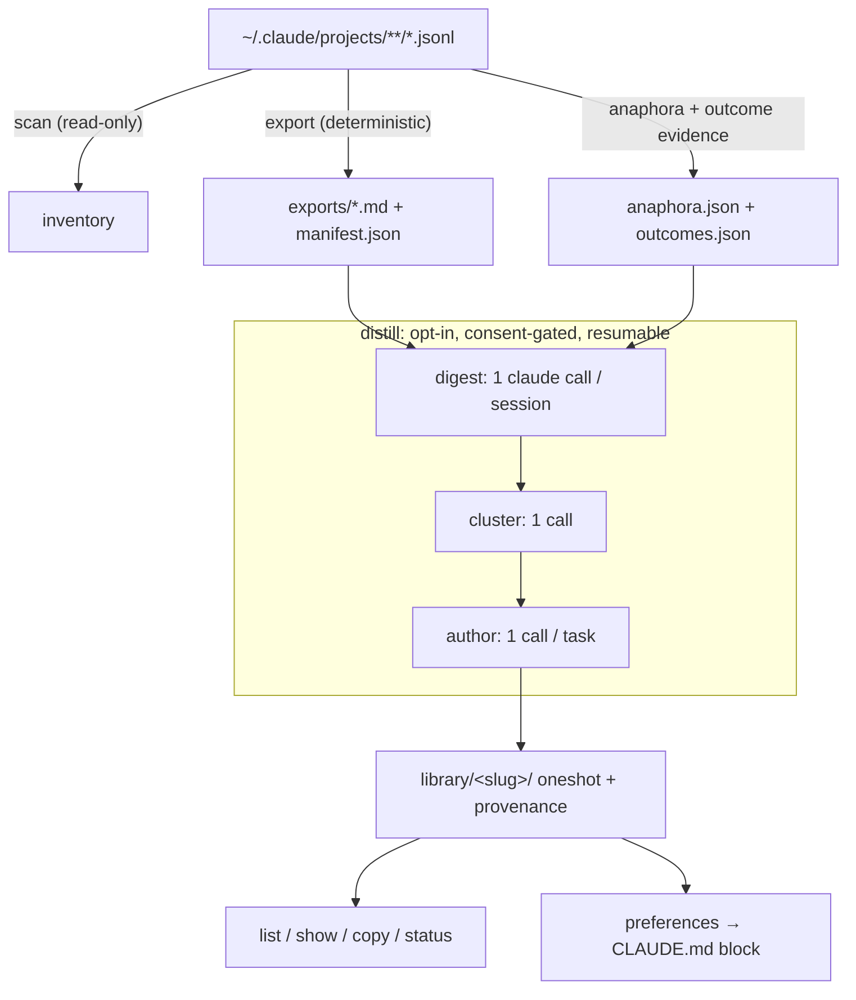

# cc-hindsight

> **The prompt you'd write if you knew then what you know now.**

[](https://www.npmjs.com/package/cc-hindsight)
[](https://github.com/adityaarunsinghal/cc-hindsight/actions/workflows/ci.yml)
[](https://nodejs.org)
[](LICENSE)
[](#privacy--trust)

<p align="center">
  
</p>

```bash
npx cc-hindsight
```

cc-hindsight mines your Claude Code session history into two things you can use
tomorrow morning:

1. **A oneshot prompt library.** For each real task you've done, the realistic
   ideal *first* prompt: everything you knew and wanted at t=0 but didn't say,
   written in your own voice.
2. **A distilled preference set.** The things you keep re-telling your agent
   ("diagnose before acting", "pin the versions", "be terse"), surfaced as a
   paste-ready `CLAUDE.md` block so every future session starts aligned.

## The t=0 problem

You get better results the more context you front-load into your first prompt,
yet we underspecify at t=0 and spend the session steering: correcting course,
restating preferences, answering questions the agent shouldn't have had to ask.

And the cost repeats every session. Your working preferences are stable facts
about how you like to work, yet you re-derive and re-type them project after
project instead of stating them once, upfront, where every future session reads
them from the first message.

All the evidence of what you *should* have said is already on disk. Claude Code
saves every session as JSONL under `~/.claude/projects/`. Plenty of tools read
that data for dashboards and transcripts. **Nobody closes the loop from history
back to better prompting.**

**Before** (what you actually typed at t=0):

> help me script blocking a device on my home router

**After** (what cc-hindsight distilled from how that session actually went):

> I want to automate my home router, starting with blocking a device. Get API
> access working first, and store any credentials securely instead of asking me
> to paste them in the clear. Anything that changes the network should be safe
> by default: show me what it'll do and let me confirm before it runs. Then
> prove it end-to-end on a real device. Research how others have done this
> first, and keep the setup written down so I can reproduce it.

The second prompt was knowable at t=0. You just hadn't written it yet.

## Quickstart

One command builds the whole library and shows it to you when it's done:

```bash
npx cc-hindsight distill    # offers to export first, then digest → cluster →
                            # author (asks before any claude call), then shows
                            # you the finished library
```

Prefer to drive each stage yourself? The pipeline is just three verbs:

```bash
npx cc-hindsight            # 1. scan: inventory your projects (read-only)
npx cc-hindsight export     # 2. export: human-only markdown per session
npx cc-hindsight distill    # 3. distill: digest → cluster → author (asks first)
```

Then browse and curate the results:

```bash
npx cc-hindsight list                # your library (✎ edited / ▲▼ rating badges)
npx cc-hindsight show <slug>         # read a oneshot
npx cc-hindsight copy <slug>         # → clipboard, paste into a fresh session
npx cc-hindsight edit <slug>         # open in $EDITOR; your edits are protected
npx cc-hindsight rate <slug> up      # record a verdict (up|down)
npx cc-hindsight prune               # remove orphaned entries (asks first)
npx cc-hindsight preferences         # → CLAUDE.md block
npx cc-hindsight status              # pipeline funnel + orphan/skip flags
```

Requires Node ≥ 22 on macOS or Linux (Windows is untested and currently
unsupported). `scan` and `export` are fully deterministic: no LLM, no
network. `distill` uses the `claude` CLI you already have, and never without
asking.

## Privacy & trust

For a tool that reads your entire conversation history, auditability is the
product:

- **Local-only.** Everything is read from your disk and written to your disk
  (`~/.cc-hindsight`). No server, no accounts, no telemetry. The only network
  call is your own `claude` CLI doing what it already does.
- **Three runtime dependencies.** [`citty`](https://github.com/unjs/citty)
  (zero-dependency CLI framework), [`zod`](https://zod.dev) (schema
  validation), and [`@clack/prompts`](https://github.com/bombshell-dev/clack)
  (progress spinners, five micro-packages under the hood). All three are
  exact-pinned, and the entire transitive tree ships locked via
  `npm-shrinkwrap.json`. The whole data path is small enough to audit in one
  sitting.
- **Consent-gated LLM use.** `distill` states the exact invocation count and
  waits for `[y/N]` before anything runs on your subscription/credits.
  `--dry-run` shows the full plan for free. If you decline, it exits without
  invoking anything (exit code 2).
- **Plain statement:** exports contain your raw prompts, including anything
  sensitive you ever pasted into a session (keys, internal names, that one
  angry message). They live in your home directory with your permissions, and
  nothing ships them anywhere. A `--redact` option is on the roadmap.

## How it works



The extraction layer is a fidelity contract: eleven audited rules decide what
counts as human input (attachments typed while the agent was busy, recovered
slash commands, `[decision]` lines from option picks, `[image pasted]`
markers), with a regression fixture per rule. Fork/resume duplicates are
deduped globally. Short replies like "yes" and "option 2" get their antecedent
attached so the author stage knows what you approved. Sessions carry an
outcome classification, so a task where nothing ever succeeded gets skipped
instead of becoming a confident prompt that reproduces a failure path.

Authored oneshots pass a **"knowable at t=0" test**: they front-load intent,
constraints, preferences, and quality bars, while leaving out facts you only
discovered mid-session (paths, root causes, error messages). And they respect
an **effort budget**, staying around the length a motivated human would
actually type rather than ballooning into a 700-word spec.

Every distill stage checkpoints to disk after each unit of work: Ctrl-C loses
nothing, re-running resumes, `--fresh` resets deliberately, and `status` flags
library entries orphaned by re-clustering.

## How it compares

| Tool | Reads `~/.claude` | Output | Direction |
|---|---|---|---|
| ccusage | ✓ | usage/cost tables | backward (metrics) |
| sniffly | ✓ | analytics dashboard | backward (behavior) |
| claude-code-transcripts | ✓ | shareable HTML transcripts | backward (record) |
| cctrace / exporters | ✓ | markdown/XML exports | backward (archive) |
| **cc-hindsight** | ✓ | **oneshot prompt library + CLAUDE.md preferences** | **forward (better next session)** |

Closest kin is Simon Willison's `claude-code-transcripts`: same local-first
values, same belief that transcripts are undervalued artifacts. The difference
is the direction of gaze: it renders your sessions (backward, for others);
cc-hindsight distills them (forward, for you).

## FAQ

**Does my data leave my machine?**
No. The deterministic commands never touch the network. `distill` pipes
content to your locally installed `claude` CLI, the same thing that happens
when you use Claude Code, and nothing else.

**What does distill cost?**
Whatever your `claude` CLI costs you: it runs on your existing subscription or
API credits. The consent prompt states the exact invocation count up front
(one call per session digested, one to cluster, one per task authored), and
`--dry-run` prints the same plan without running anything. Checkpoints mean an
interrupted run isn't wasted money. Sessions too large for the input budget
(default 400k chars, `--input-budget`) are **refused before anything is
spent**. Re-run with `--truncate=extreme` to cut them (recorded in
provenance) or narrow the scope. Digest and author calls run 3 at a time by
default (`--concurrency`; `1` = sequential).

**Subscription or API?**
Either. cc-hindsight shells out to `claude -p`; however your CLI is
authenticated is how the calls are billed. `--model` passes through.

**Why is a session missing from my exports?**
Sessions with zero human messages are skipped naturally, `--min-messages`
filters thin ones, and fork/resume copies are deduped into their original
session. Note that dedupe is global across all projects: with `--project`, a
message duplicated by fork/resume is attributed to its earliest session even
when that session is outside the filter. Run `export --verbose` to see every
dropped piece with a reason. If genuine human input was dropped, that's a
bug: file an extraction-fidelity report.

**Can I regenerate everything from scratch?**
`cc-hindsight distill --fresh` clears the checkpoints (after confirming) and
re-runs. Old library entries from previous generations are flagged as orphans
in `status`.

## Roadmap

- Claude Code **plugin packaging** for existing marketplaces (for
  distribution, without standing up a separate marketplace)
- An in-session **skill variant** ("distill this session as we go")
- **Agent SDK** orchestration exploration
- **parentUuid-aware anaphora** (branch-correct antecedents on forked
  conversations)
- **`--redact` patterns** for exports
- An opt-in **community oneshot showcase**

## Development

```bash
npm install
npm test            # vitest: fixtures only, never reads your ~/.claude
npm run lint        # biome
npm run typecheck   # tsc --noEmit
npm run build       # tsdown → dist/
```

See [CONTRIBUTING.md](CONTRIBUTING.md), especially the guide to adding a
fixture when you hit an unhandled transcript shape.

## License

[MIT](LICENSE)

## Author

Built by [Aditya Singhal](https://adityasinghal.com). If cc-hindsight surfaces
a pattern you didn't know you had, [I'd love to hear about
it](https://github.com/adityaarunsinghal/cc-hindsight/issues).
